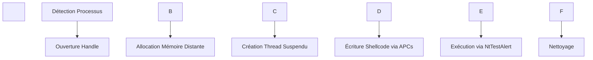
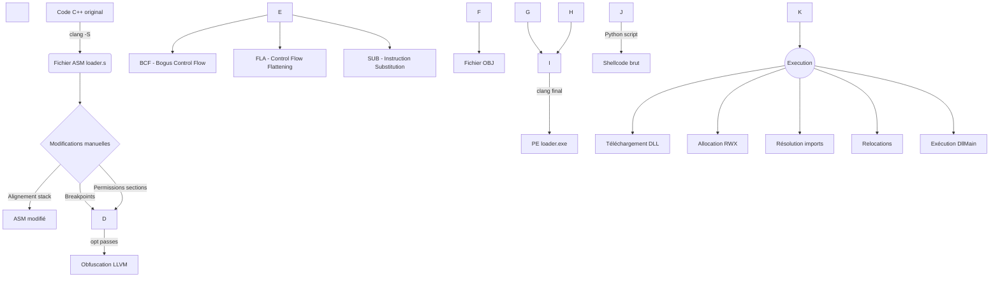

Dans le cadre du cours de dévelopement de malware durant les cours de deuxième années, nous (Victore Renault, Kylian Boulard de Pouqueville) avons décidé d'aller un peu plus loin que le projet orginal est de faire un c2 custom, un shellcode loader, un shellcode et un agent.

\## Le shellcode Loader

\### Description


Une premiere fonction est appeler faisant plusieurs check d'antidebug

Le loader utilise ensuite les fonctions de la winAPi via des indirects syscall

Le loader va ecrire et executer un shellcode dans un remote thread via des appel de procedure asynchrone.


\### Fonctionnalités Principales

\- Injection de shellcode via APC (Asynchronous Procedure Calls)

\- Utilisation indirecte des syscalls pour contourner les hooks usermode

\- Techniques anti-debug et anti-sandbox

\- Chiffrement XOR basique du shellcode

\- Résolution dynamique des API via hashage


\### Workflow d'Exécution




&nbsp;   

\## Compilation 


utilisation utilisation de visual studio via le sln fournis


\## Shellcode - Reflective DLL Injection 


\### Description


Ce projet est un shellcode écrit en C++ sans dépendances externes, conçu pour charger et exécuter une DLL en mémoire sans jamais l'écrire sur le disque. Il implémente une technique de "Reflective Loading" avancée avec les caractéristiques suivantes :


\- \*\*Position Indépendante\*\* : Le code peut s'exécuter depuis n'importe quel emplacement mémoire

\- \*\*Processus en 2 étapes\*\* :

&nbsp; 1. Téléchargement de la DLL depuis un C2 via HTTP

&nbsp; 2. Chargement et exécution réflexive en mémoire

\- \*\*Aucune trace sur disque\*\* : La DLL reste exclusivement en mémoire


\### Fonctionnement technique


\#### 1. Phase de téléchargement

\- Se connecte au serveur C2 sur l'endpoint `/getDLL`

\- Récupère la DLL sous forme de bytearray brut

\- Utilise les API WinINet (InternetOpenA, InternetOpenUrlA, InternetReadFile)


\#### 2. Phase de chargement réflexif

\- Alloue de la mémoire exécutable avec VirtualAlloc

\- Parse les en-têtes PE de la DLL

\- Effectue les relocations nécessaires

\- Résout les imports dynamiquement

\- Exécute l'entrypoint de la DLL via son DllMain


\### Compilation

```powershell

clang Injected.cpp -Os -S -masm=intel -nostdlib -fno-stack-protector -Wno-invalid-noreturn -Wl,/ENTRY:\_start -Wl,/SUBSYSTEM:WINDOWS -o loader.s

```

On commence par sortir uniquement de l'assembleur,

ce qui vas nous permetre de faire des modification avancé, comme de l'alignement de stack ou forcé des section et leurs permission facilement ansi que de modifier de la data ou inclure des breakpoint  pour debug suite a cela 

Au vu du faite qu'on utilise clang, donc llvm, il serais possible d'utilise des passe llvm pour de l'obfuscation ou autre (opacque predicate, cfg,bcf ...)

```powershell

clang loader.s -nostdlib -fno-stack-protector -Wno-invalid-noreturn -Wl,/ENTRY:\_start -Wl,/SUBSYSTEM:WINDOWS -o loader.exe

```

et on vas récupéré notre shellcode sous forme de tableau avec script python


```python

import pefile

import sys


def generate\_shellcode(input\_file):

&nbsp;   try:

&nbsp;       pe = pefile.PE(input\_file)

&nbsp;       text\_data = bytearray()

&nbsp;       func\_data = bytearray()

&nbsp;       

&nbsp;       for section in pe.sections:

&nbsp;           name = section.Name.decode().strip('\\x00')

&nbsp;           if name == '.00start':

&nbsp;               text\_data = section.get\_data()

&nbsp;           elif name == '.func':

&nbsp;               func\_data = section.get\_data()

&nbsp;  

&nbsp;       combined =func\_data + text\_data     

&nbsp;   


&nbsp;       output = "unsigned char shellcode\[] = {\\n    "

&nbsp;       

&nbsp;       for i, byte in enumerate(combined):

&nbsp;           output += f"0x{byte:02x}"

&nbsp;           if i != len(combined) - 1:

&nbsp;               output += ", "

&nbsp;               if (i + 1) % 12 == 0:

&nbsp;                   output += "\\n    "

&nbsp;       

&nbsp;       output += "\\n};\\n"

&nbsp;       output += f"unsigned int shellcode\_len = {len(combined)};"

&nbsp;       

&nbsp;       return output

&nbsp;       

&nbsp;   except Exception as e:

&nbsp;       print(f"Erreur: {str(e)}")

&nbsp;       return None

&nbsp;   finally:

&nbsp;       pe.close()


if \_\_name\_\_ == "\_\_main\_\_":

&nbsp;   if len(sys.argv) != 2:

&nbsp;       print("Usage: python pe\_to\_shellcode.py <fichier.exe>")

&nbsp;       sys.exit(1)

&nbsp;   

&nbsp;   result = generate\_shellcode(sys.argv\[1])

&nbsp;   if result:

&nbsp;       print(result)

&nbsp;       with open("shellcode.h", "w") as f:

&nbsp;           f.write(result)

&nbsp;       print("\\nFichier shellcode.h généré avec succès!")


```




\# C2 / Agent DLL


\### Compilation 


utilisation utilisation de visual studio via le sln fournis


\### Description


Webshell communiquant avec l'agent

Un endpoint pour enregistrer des commandes, et pour que l'agent puisse lire les commandes enregistrer

D'autre pour communiquer avec


L'agent est une dll, télécharger par le shellcode, via du réflective loading, donc sans toucher le disque

Il permet des commandes customs qui peuvent être modifier au runtime


\### Features:


Revshell

Command Custom

Sleep

Download


