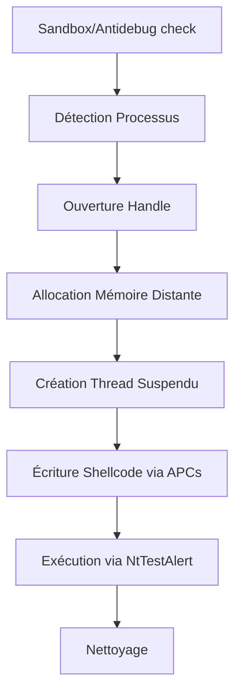
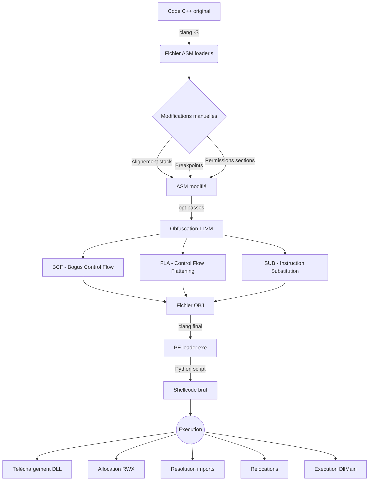
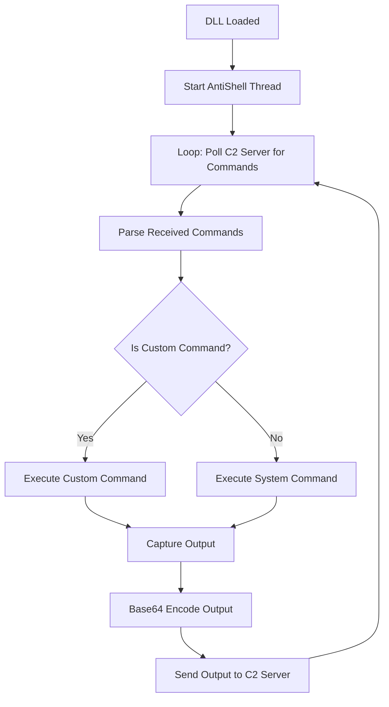
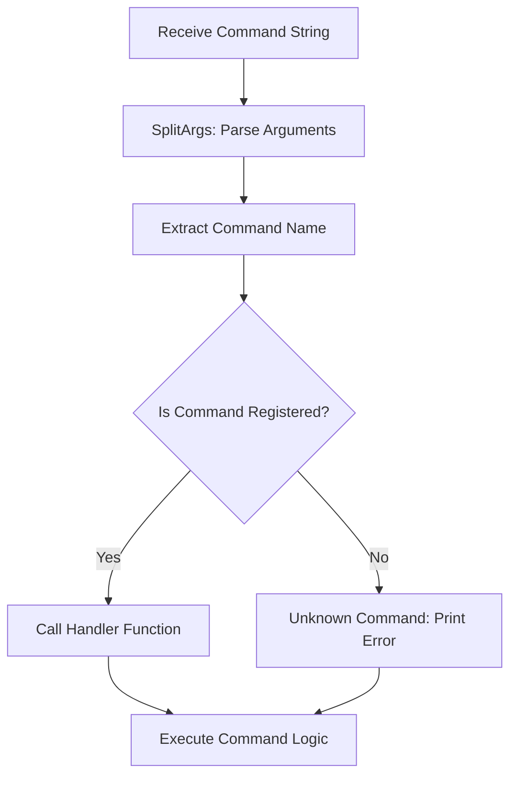

# HellCodeLoader - Process Injection & C2 Framework

## Overview

HellCodeLoader is a student project focused on malware development (maldev) techniques. It demonstrates advanced process injection using indirect syscalls, Asynchronous Procedure Calls, reflective DLL loading, and a custom command-and-control (C2) web server. The project is modular, with each component fulfilling a specific role in the infection and control chain.

## Usage

1. **Start the C2 server**  
   `python c2.py`

2. **Run the injector** 
   - The injector will search for `notepad.exe` (or modify for another target).
   - Injects the shellcode, which downloads and loads the agent DLL.

3. **Interact via the web interface**  
   - Access `http://127.0.0.1:5000` in your browser.
   - Send commands to the agent, view outputs, and manage files.


## Project Structure

- **shellcode/shellcode.cpp**  
	  Generates the shellcode payload. Implements manual PE loading, API resolution, and network download of the agent DLL from the C2 server. The shellcode is compiled to raw opcodes for injection.

- **HellCodeLoader/PI_WE_ACP.cpp**  
	  The process injector and shellcode loader. It locates a target process (e.g., `notepad.exe`), performs anti-debug/sandbox checks, allocates memory in the remote process, writes the shellcode byte-by-byte using APCs, and triggers execution via indirect syscalls.

- **HellCodeLoader/main.asm**  
	  Implements indirect syscalls for critical Windows API functions (e.g., `NtOpenProcess`, `NtAllocateVirtualMemory`, `NtQueueApcThread`). This bypasses user-mode hooks and increases stealth.

- **agent/dllmain.cpp**  
	  The agent DLL loaded reflectively by the shellcode. Handles communication with the C2 server, executes received commands, and sends output/results back. Supports both system and custom commands.

- **agent/custom_command.cpp**  
	  Provides a wrapper for custom agent commands.
	  Currently supports:
		  - `Sleep <ms>`: Pauses agent execution.
		  - `Upload <URL> <Destination>`: Downloads a file from a URL to the target system.

- **c2.py**  
	  Flask-based web C2 server. Handles agent registration, command dispatch, output collection, and file delivery (DLL payload). Includes a simple web interface for operator interaction.

## Build Instructions

### Prerequisites

- Visual Studio 2022 (C++14)
- MASM (for `main.asm` and `syscall.masm`)
- Python 3.x (for `c2.py`)
- Flask & Flask-CORS (`pip install flask flask-cors`)

### Steps

1. **Build the shellcode**
   - Compile `shellcode.cpp` to produce raw shellcode bytes.
   - Use the output in `PI_WE_ACP.cpp` for injection.

2. **Build the injector**
   - Compile `PI_WE_ACP.cpp` and link with `main.asm` and `syscall.masm`.
   - Ensure all headers and MASM files are included in the project.

3. **Build the agent DLL**
   - Compile `dllmain.cpp` and `custom_command.cpp` as a DLL.
   - Output should be `agent.dll`.

1. **Start the C2 server**
   - The server will listen on `http://127.0.0.1:5000`.
   - Run `python c2.py`.

# How it works ?

## ShellcodeLoader - PI_WE_ACP.cpp

#### Workflow


#### Details

The PI_WE_ACP.cpp file is the main process injector and shellcode loader for the project. 
Its primary function is to inject the shellcode (generated from `shellcode.cpp`) into a target process, such as `notepad.exe`, using advanced techniques for stealth and reliability.

The file begins with anti-debugging and anti-sandbox checks to avoid execution in analysis environments. It then locates the target process by name, opens it using an `indirect syscall` to `NtOpenProcess`, and allocates executable memory in the remote process via `NtAllocateVirtualMemory`.

Instead of writing the shellcode in bulk, it uses `Asynchronous Procedure Calls` (APCs) to write the shellcode byte-by-byte into the remote process memory, leveraging `NtQueueApcThread` and `RtlFillMemory` for stealth. 
After the shellcode is written, it queues an APC to execute the shellcode in the context of a newly created suspended thread, then resumes the thread to trigger execution.

All critical Windows API calls are resolved and invoked via `indirect syscalls`, bypassing user-mode hooks and increasing evasion. 
The file also includes utility functions for hashing, module/PE parsing, and process/thread enumeration.

In summary, `PI_WE_ACP.cpp` orchestrates the entire injection workflow, from process discovery and anti-analysis to stealthy shellcode delivery and execution, making it the core loader component of the project.

## Shellcode - Shellcode.cpp

#### Workflow



#### Details

The `shellcode.cpp` file is responsible for generating the main shellcode payload that will be injected into the target process by the injector. This shellcode is designed to be fully autonomous, avoiding direct use of standard Windows APIs by dynamically resolving the addresses of required functions through manual inspection of the `Process Environment Block (PEB)`.

It defines internal Windows loader structures (`PEB`, `LDR`, etc.) to navigate the process memory and locate loaded modules such as `kernel32.dll` and `wininet.dll`. Custom implementations of functions like `GetModuleHandleA` and `GetProcAddress` are provided to evade detection by security tools.

The main function, `_start`, downloads the agent DLL from the C2 server via HTTP (using dynamically resolved `wininet.dll` functions), allocates memory for it, and loads it reflectively using `LoadLibraryInMemory`. This function reconstructs the DLL in memory, resolves its imports, applies relocations, and calls its entry point (`DllMain`).

In summary, this file encapsulates all the logic needed to download and load the agent DLL in memory, allowing the loader to inject a highly stealthy and self-sufficient payload into the target process, while bypassing standard APIs and security hooks.

####  Compilation

```powershell
clang Injected.cpp -Os -S -masm=intel -nostdlib -fno-stack-protector -Wno-invalid-noreturn -Wl,/ENTRY:_start -Wl,/SUBSYSTEM:WINDOWS -o loader.s
```

We'll start by going outside of the assembler, which will allow us to make advanced modifications, such as stack alignment or forcing sections and their permissions easily, as well as modifying data or including breakpoints for debugging purposes. Given that we're using clang, and therefore llvm, it would be possible to use llvm passes for obfuscation or other purposes (opaque predicate, cfg, bcf, etc.).

```powershell
clang loader.s -nostdlib -fno-stack-protector -Wno-invalid-noreturn -Wl,/ENTRY:_start -Wl,/SUBSYSTEM:WINDOWS -o loader.exe
```

and we will recover our shellcode in table form with the script `pe_to_shellcode.py`

Then add the shellcode to the PI_WE_ACP.cpp


## DLL - agent.dll / dllmain.cpp

#### Workflow



#### Details

The `dllmain.cpp` file implements the agent DLL that is reflectively loaded into the target process by the injected shellcode. 
Its main purpose is to establish communication between the infected process and the C2 server, execute received commands, and return the results.

Upon loading (in any DLL event), the `AntiShell` thread is started. 
This thread continuously polls the C2 server for new commands using HTTP requests. 

When a command is received, it first checks if it matches a custom command (handled by `CustomCommand` from `custom_command.cpp`). 
If so, the custom logic is executed; otherwise, the command is executed as a system command using a shell (`_popen`).

The output of each command is captured, base64-encoded, and sent back to the C2 server via an HTTP POST request. 
The DLL uses WinINet APIs for all network communication, and the encoding/decoding functions ensure safe transmission of command results.

In summary, `dllmain.cpp` acts as the core agent logic, enabling remote control and data exfiltration from the infected process, supporting both custom and system commands, and maintaining persistent communication with the C2 server.

## Custom Command - custom_command.cpp

#### Workflow




#### Details

The `custom_command.cpp` file implements the custom command framework for the agent DLL. It allows the agent to recognize and execute specialized commands sent from the C2 server, beyond standard system commands.

It maintains a map of command names to handler functions (`my_map`), with built-in support for Sleep (pauses execution for a specified time) and Upload (downloads a file from a given URL to a specified path). 
The `RegisterCommand` function enables dynamic registration of additional custom commands.

When a command is received, the `CustomCommand` function parses the command string, splits it into arguments, and checks if the command name exists in the map. 
If found, the corresponding handler is invoked with its arguments, otherwise, the command is ignored as unknown.

This modular design makes it easy to extend the agent’s capabilities by adding new custom commands, supporting flexible and stealthy post-exploitation actions controlled remotely from the C2 server.